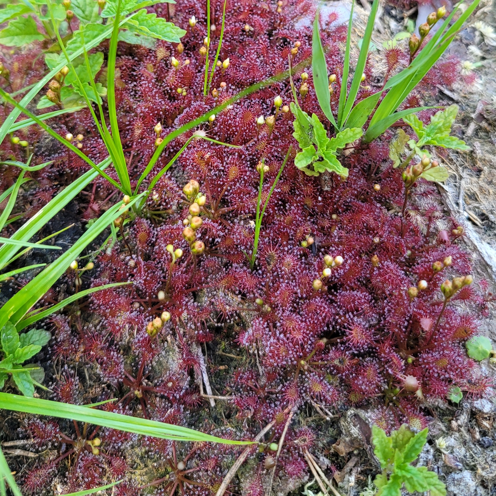

## Opis

Krótki opis rośliny, jej wyglądu, pochodzenia i cech szczególnych.

## Wymagania

Światło, podłoże, podlewanie, wilgotność i temperatura.

## Notatki

Daty przesadzenia, kwitnienia, problemy, regeneracja, nowe zdjęcia.